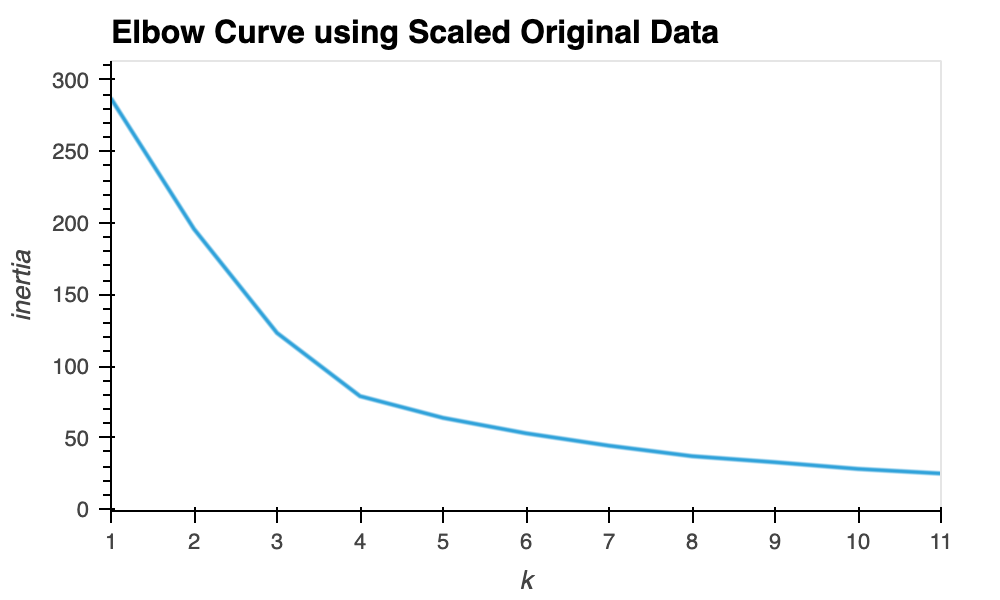
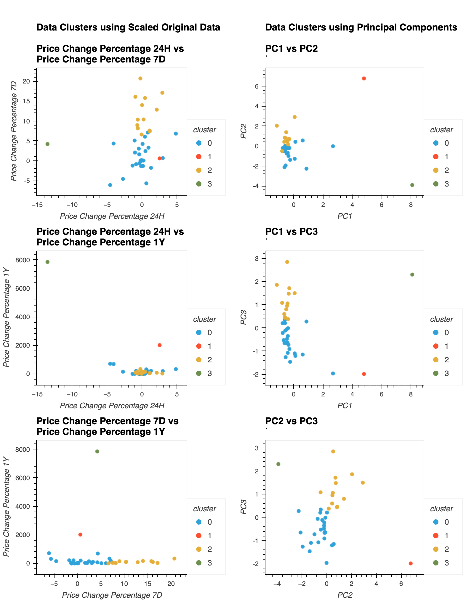

# CryptoClustering

**Student name:** Tania Barrera

---

This repo contains my work for the challenge that corresponds to Module 19 of the UofT SCS edX Data Bootcamp.

---

## Deliverable

Notebook: [Crypto_Clustering.ipynb](Crypto_Clustering.ipynb)

---

## Results

### Elbow Plot to find optiomal k value using Scaled Original Data

**Question:** What is the best value for k?

**Answer:** From the plot, I would guess 4, since that is the point where the slope stabilizes and starts dropping more steadily.

### PCA

**Question:** What is the total explained variance of the three principal components?

**Answer:** The total is 89.5%. Each principal component individually explains 37.2%, 34.7% and 17.6%.

### Elbow Plot to find optiomal k value using PCA Data

**Question:** What is the best value for k when using the PCA data?

**Answer:** It seems to be 4, since that is where the elbow curve starts having a smooth slope.

**Question:** Does it differ from the best k value found using the original data?

**Answer:** No, that is the same value I chose previously

### Cluster Analyses with K-Means using Scaled Original Data and using PCA Data

**Question:** After visually analyzing the cluster analysis results, what is the impact of using fewer features to cluster the data using K-Means?

**Answer:** Using the reduced features we obtained through PCA allows us to clearly isolate the different clusters in the visualizations. 
We can better see how the variance in the features used to cluster influenced the groupings. 
Although it is not clear how the features obtained from the PCA are related to the original features, 
if we wish to explore the underlying causes of the clustering, 
we can perform further visualizations with the clusters generated with the principal components and the original features.

---

## References

Data for this dataset was generated by edX Boot Camps LLC, and is intended for educational purposes only.

Challenge instructions and starter files, as well as some code sections that were adapted from the UofT SCS EdX Data Bootcamp class activities:

© 2022 edX Boot Camps LLC. Confidential and Proprietary. All Rights Reserved.
